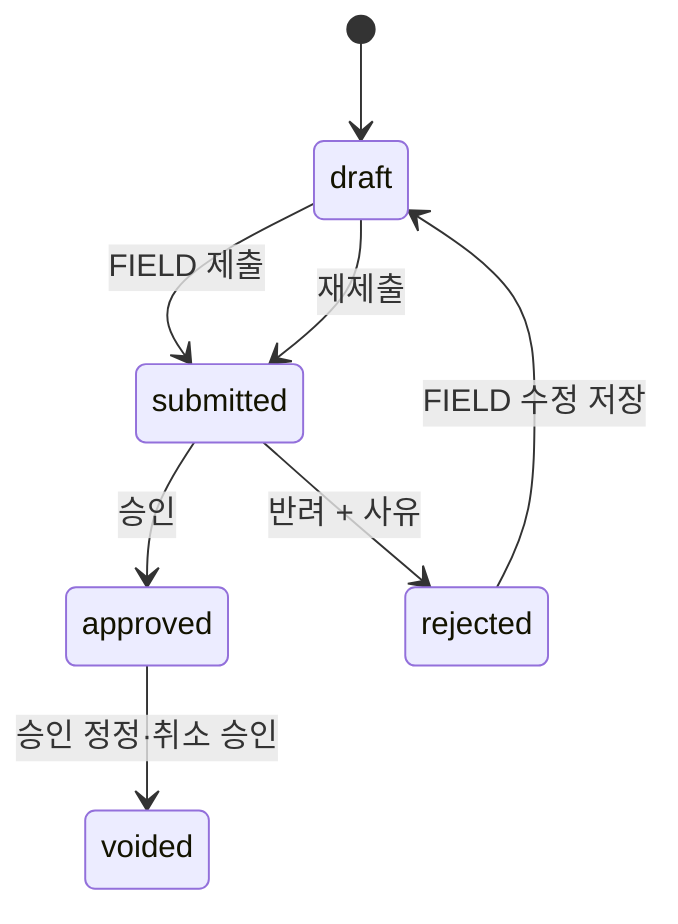

# ERD·프로세스맵·기능정의서 대비 코드 갭 분석

> 분석 기준: 2026-08-25. 이 문서는 구현 여부 판단 문서이며, 여기서는 코드를 변경하지 않는다. 우선순위 높은 항목부터 별도 변경 작업으로 처리해야 한다.

## 결론

**P0 정합성 결함은 수정 완료했다.** 진행률 반려 상태·원가 원본 상태 동기화·기존 데이터 보정까지 반영했다. `DAILY_REPORT`의 HQ 통합 승인목록 중복 노출, `Transfer`의 모델 단계 법인 검증, 중복 import도 함께 정리했다. 범용 승인 서비스의 역할별 정책 강제와 월마감 전 전사 대사 정책은 별도 승인정책 설계가 필요한 후속 작업이다.

## 1. 수정 우선순위

| 우선순위 | 갭 | 코드 근거 | 문서/업무 영향 | 권장 조치 |
|---|---|---|---|---|
| P0 완료 | 진행률 반려 상태 불일치 | `DailyProgress`에 `rejected` 및 반려/승인 스냅샷 열 추가, 승인 서비스·재제출 흐름 동기화 | FIELD 반려 수정·재제출 상태가 모델/화면/승인 흐름과 일치 | `schedule.0007_dailyprogress_rejection_metadata` 적용 및 승인 회귀 테스트 통과 |
| P0 완료 | 원가 승인과 원본 일일보고 상태 분리 | CostActual 승인·반려 시 source DailyReport를 같은 트랜잭션에서 동기화 | 가짜 승인 대기 재발 방지 | 기존 승인 원가 11건을 dry-run 후 보정하고 AuditLog 11건 생성 |
| P1 | 진행률 승인 메타데이터가 도메인 행에 없음 | `DailyProgress`는 승인자·승인시각·반려사유 열이 없고 `ApprovalRequest`만 보유 | 논리 ERD의 ‘도메인 객체가 최종 상태 원천’ 원칙과 감사 상세가 분산됨 | `approved_by`, `approved_at`, `rejected_by`, `rejected_at`, `reject_reason`을 추가하거나, ApprovalRequest를 단일 불변 승인 원장으로 명시하고 모든 조회를 일관되게 조인 |
| P1 | 범용 승인 서비스의 권한/법인 범위 방어가 약함 | `approve_request`/`reject_request`는 상태 갱신과 AuditLog는 수행하나 호출자 역할·법인 멤버십을 직접 검사하지 않음 | URL/View 외부 호출 또는 신규 API 추가 시 법인·승인자 통제가 누락될 위험 | 객체 유형별 승인정책(허용 역할, 계약 법인, 프로젝트 범위)을 서비스 계층에서 검증. 기존 View 검증은 유지 |
| 완료 | `DailyReport`가 여러 승인/목록 경로에 중복 노출 | HQ 통합 승인함·승인완료 분류에서 `DAILY_REPORT`를 제외하고 `CostActual` 승인 흐름으로 단일화 | 원가 원본이 독립 보고로 중복 표시되는 문제 제거 | 과거 `DAILY_REPORT` 승인 이력은 보존하며, 필요 시 조회전용 이력 화면만 별도 제공 |
| 완료 | 법인 소유 경계가 서비스 우회 시 약화될 수 있음 | `Transfer.clean()`에 출발/도착 창고 법인 일치와 프로젝트 계약 법인 일치 검증 추가 | 관리자·ORM 직접 저장에서도 타 법인 이관 차단 | 다중 테이블 조건은 DB CheckConstraint로 표현할 수 없어 모델·서비스 이중 검증 유지 |
| P2 | 마감·대사 차단은 기성보고 생성에는 연결됐으나, 월마감 자체의 사전 대사 정책은 명시적 일관성 점검 필요 | `build_project_reconciliation()`은 기성보고 생성 서비스에서 호출됨 | 프로세스맵의 ‘대사 후 마감’이 모든 마감 진입점에서 동일하게 강제돼야 함 | 법인 월마감 전 대상 프로젝트 대사 기준과 예외 승인 방식을 `close_month()` 서비스에도 명시·테스트 |
| 완료 | 코드 정리 | `apps/closing/web_views.py`의 `build_project_reconciliation` 중복 import 제거 | 유지보수 혼선 제거 | 정적 린트는 기존 CI 도입 범위에서 별도 관리 |

## 2. P0 상세: 진행률 반려 흐름

### 현재 상태

```text
FIELD 제출 → DailyProgress.status = submitted
CEO/HQ 범용 승인 반려 → ApprovalRequest.status = rejected
                         → DailyProgress.status = rejected  ← 모델 choices에 없음
```

`DailyProgress`의 화면 코드도 일부는 `rejected`를 편집 가능한 상태로 취급하지만, 모델 정의와 문서에는 존재하지 않는다. DB 열이 일반 문자열이어서 저장될 수는 있어도, ModelForm·관리화면·상태 분기·보고서에서는 비정상 값이 된다.

### 권장 목표 상태



권장 이유: 사용자가 반려 사유를 확인하고 수정·재제출하는 현재 FIELD 업무 요구와 일치하며, AuditLog와 ApprovalRequest는 각 제출 차수의 결정을 보존할 수 있다.

### 변경 단위

1. `schedule.models.DailyProgress`에 `rejected` choice 및 반려 이력 열을 추가한다.
2. `approve_request`/`reject_request`에서 진행률 상태·사유·결정자를 원자적으로 갱신한다.
3. FIELD 편집, 목록 배지, HQ/CEO 대기 큐, KPI 집계에서 rejected를 일관되게 제외/재작업 대상으로 처리한다.
4. 기존 `status='rejected'` 행을 검사하고 마이그레이션 전후 행 수를 대사한다.
5. 제출→반려→수정→재제출→승인, 마감월 반려, 소급 입력, 법인 범위 회귀 테스트를 추가한다.

## 3. P0 상세: DailyReport와 CostActual 책임 분리

### 현재 상태

```text
FIELD 원가 입력
  → DailyReport(DRAFT/SUBMITTED) 생성
  → CostActual(동일 원본 1:1) 생성
  → COST_ACTUAL 승인
  → CostActual=APPROVED, IssueToWork=APPROVED
  → DailyReport=SUBMITTED 유지 가능
```

이 상태는 DailyReport가 독립 승인 업무처럼 잘못 보이는 원인이다. HQ 홈은 현재 DailyProgress로 변경했지만, 데이터 원천의 상태 불일치는 남아 있다.

### 권장 설계

- **선택 A — 권장:** DailyReport를 CostActual의 내부 원본으로 명확히 둔다. 별도 승인 요청·승인 큐·완료목록에서는 제외하고, CostActual의 상태를 화면에 표시한다. DailyReport 상태는 제거하거나 CostActual 상태에서 파생한다.
- **선택 B — 호환 우선:** 상태 열은 유지하되 CostActual 제출/승인/반려 시 source_daily_report를 같은 트랜잭션에서 동기화한다. 어느 화면에서도 DailyReport만 단독 승인 대상으로 노출하지 않는다.

현재 데이터와 기존 URL 호환을 고려하면 **선택 B를 먼저 적용하고, 이후 선택 A로 정리**하는 것이 안전하다.

### 변경 단위

1. CostActual 제출·승인·반려·날짜정정 서비스에서 source_daily_report 상태와 날짜를 동기화한다.
2. `DAILY_REPORT` ApprovalRequest 생성 경로를 금지하거나, 과거 요청을 조회전용으로 분리한다.
3. HQ 승인함/승인완료/CEO 카드에서 `DAILY_REPORT`를 필터링하거나 CostActual 하위 증빙으로 병합한다.
4. 현재 `DailyReport.status='submitted'`이면서 연결 CostActual이 approved/rejected/closed인 행을 대사·보정한다. 자동보정 전 목록과 승인자 확인이 필요하다.

## 4. 영향 없는 항목 또는 이미 충족된 항목

| 영역 | 판단 | 근거 |
|---|---|---|
| 프로젝트 계약 법인 | 현재 충족 | `Project.legal_entity` FK와 프로젝트 코드 시퀀스 법인 범위 |
| 창고 이관 법인 경계 | 서비스 경로에서는 충족 | `create_transfer()`가 창고 법인 동일성과 프로젝트 법인 일치를 검증 |
| 기성/준공 대사 | 기성보고 생성 경로에서 충족 | `BillingReport` 생성 서비스가 `build_project_reconciliation()` 결과의 blocking issue를 검사 |
| 선급금·세금계산서·매출 인식 | 현재 설계와 대체로 일치 | 선급금/기성/발주처 확정/세금계산서/매출 인식 모델과 서비스 존재 |
| 법인별 월마감 | 기본 경계 충족 | `ClosingPeriod`의 `(legal_entity, year, month)` UniqueConstraint |

## 5. 권장 구현 순서

1. **P0-1 진행률 반려 상태**: 모델/마이그레이션/승인 서비스/화면 배지/테스트.
2. **P0-2 일일보고-원가 동기화**: 과거 데이터 대사 보고서 → HQ 승인 후 보정 → 제출·승인 서비스 수정.
3. **P1 승인 서비스 정책화**: 객체 유형별 승인자·법인 범위 검증을 공통 서비스로 추출.
4. **P1 승인목록 정리**: DAILY_REPORT 중복 표시 제거 및 기존 승인 이력 호환 처리.
5. **P2/P3**: Transfer 모델 방어 강화, 월마감 사전대사 명문화, 중복 import 정리.

## 6. 수정 전 필수 검증·복구 기준

- 영향 테이블의 상태별·법인별·프로젝트별 행 수를 변경 전 CSV로 보관한다.
- 데이터 보정은 dry-run 결과와 HQ 승인 후에만 실행하며, 승인된 원가·마감·세금계산서 행을 삭제하거나 재작성하지 않는다.
- `makemigrations --check`, `migrate --plan`, 승인·마감·법인 범위·FIELD 재작업 회귀 테스트를 통과해야 한다.
- 실패 시 신규 코드만 되돌리고, 데이터 보정은 별도 AuditLog/백업을 근거로 역보정한다.

## 7. 근거 코드

- `apps/core/services/approvals.py`
- `apps/schedule/models.py`, `apps/field/web_views.py`, `apps/schedule/progress_corrections.py`
- `apps/field/models.py`, `apps/cost/models.py`, `apps/core/views.py`
- `apps/inventory/models.py`, `apps/inventory/services.py`
- `apps/closing/reconciliation.py`, `apps/finance/services/billing_reports.py`, `apps/closing/services.py`
