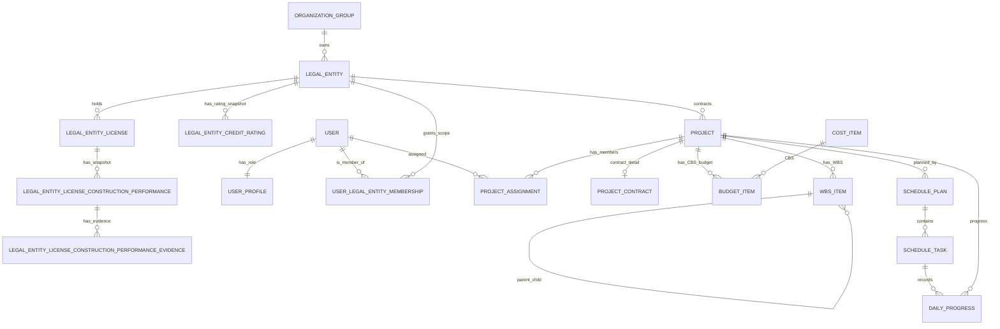
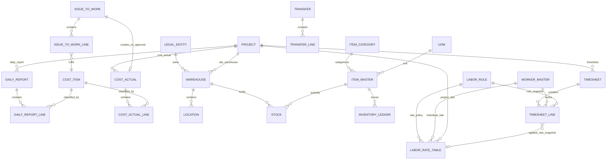
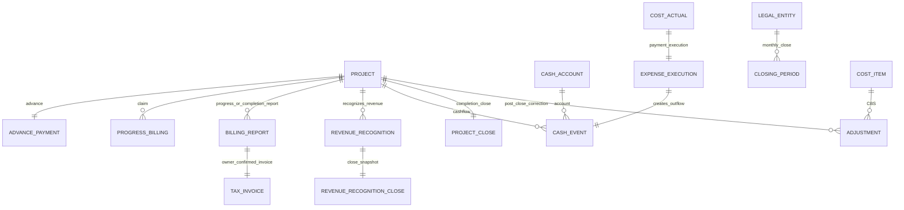

# 건설 ERP 논리 ERD

> 기준: 2026-08-27 현재 Django 모델. 이 문서는 업무 개념과 관계를 설명하는 논리 모델이며, 실제 테이블명·인덱스·제약은 [Physical ERD](current_system_physical_erd.md)를 따른다.

## 1. 설계 경계

- **법인**은 계약·현금·창고·급여·월마감의 소유 경계다. 프로젝트는 계약 법인을 하나만 가진다.
- **프로젝트**는 계약, CBS 예산, WBS 일정, 현장 입력, 기성/매출, 마감의 중심 집계 단위다.
- **승인·마감 후 변경**은 원본을 임의 수정하지 않고 승인 흐름·정정 객체·감사 로그로 남긴다.
- 본사직원은 여러 법인 프로젝트에 배정될 수 있으나, 급여 소유 법인은 `OfficeEmployeeProfile.employment_legal_entity`와 `OfficePayrollRun.legal_entity`로 분리한다.

## 2. 상위 업무 도메인

## 3. 현장·원가·재고·노무

## 4. 매출·현금·기성·마감

## 5. 핵심 엔터티 정의

| 업무 개념 | 논리 엔터티 | 핵심 의미 |
|---|---|---|
| 그룹/법인 | OrganizationGroup, LegalEntity, LegalEntityLicense, LegalEntityCreditRating, LegalEntityLicenseConstructionPerformance, LegalEntityLicenseConstructionPerformanceEvidence | 아산·미산의 법인 소유·면허, 신용평가등급, 공종별 3년/5년 실적 스냅샷 및 실적증명서 이력 |
| 사용자 권한 | UserProfile, UserLegalEntityMembership, ProjectAssignment | 역할, 법인 접근 범위, 프로젝트 배정 |
| 계약/기준정보 | Project, ProjectContract, ContractSnapshot, ContractChange | 계약 원본 및 변경 시점 보존 |
| 예산/CBS | CostItem, CostItemAlias, BudgetItem | 전사 CBS와 프로젝트별 승인 예산 |
| 일정/WBS | WBSItem, SchedulePlan, ScheduleTask | 공정구조·기준일정·가중치 |
| 진행률 | DailyProgress, ProgressCorrectionRequest, RetroactiveEntryRequest | 현장 일일 입력·정정·소급 입력 통제 |
| 현장보고/증빙 | DailyReport, FieldReport, Evidence | 원가 입력의 일일 원본, 별도 현장보고, 첨부 증빙 |
| 원가 | CostActual, CostActualLine | 승인 전/후 원가 실적, VAT 구분 포함 |
| 재고 | Warehouse, Stock, InventoryLedger, Transfer, IssueToWork | 법인 소유 재고와 이관·현장 투입 |
| 일용노무 | WorkerMaster, LaborRole, LaborRateTable, Timesheet | 근로자·직종 단가·출역·적용단가 스냅샷 |
| 본사급여 | OfficeEmployeeProfile, OfficePayrollRun, OfficePayslip, PayrollAllocationBatch | 고용 법인 급여, 명세, 프로젝트 배부 |
| 기성/매출/현금 | BillingReport, TaxInvoice, RevenueRecognition, CashEvent | 기성보고→발주처 확정→세금계산서→매출 인식 및 수금 |
| 마감/감사 | ClosingPeriod, Adjustment, ApprovalRequest, AuditLog, RiskFinding | 월마감·정정·승인·추적·리스크 |

## 6. 핵심 상태 흐름

| 객체 | 대표 상태 | 통제 원칙 |
|---|---|---|
| 프로젝트 | draft, submitted, approved, planned, active, closed | 모델은 상태값을 제공하며, 전이 순서는 서비스·화면 흐름에서 통제 |
| 진행률 | draft → submitted → approved 또는 rejected; approved → voided | 반려 사유를 남기고 FIELD가 수정·재제출한다. 승인 후 변경/취소는 ProgressCorrectionRequest로 처리 |
| 출역/원가/자재투입 | draft → submitted → approved 또는 rejected | FIELD 수정은 임시/반려에 한정; 승인값은 집계 근거 |
| 기성·준공 보고서 | draft → engineer input → HQ approved/CEO review → locked | 발주처 확정 전에는 세금계산서 발행 불가 |
| 비용 집행 | ready → scheduled → paid/cancelled | CEO 승인 원가만 HQ 집행 대상으로 생성 |
| 월 마감 | open → closed | 법인·연월 단위; 마감 후에는 Adjustment 절차 |
| 본사 급여 | draft → submitted → approved/paid, rejected 또는 void | 급여 정정은 Correction 요청·승인·적용으로 분리 |

## 7. 논리 모델 주의사항

1. `ApprovalRequest`와 도메인별 상태 필드는 함께 존재한다. 범용 승인함은 알림/요청 허브이고, 각 도메인 객체가 최종 업무 상태의 원천이다. `DailyReport`는 원가 입력의 원본 보조 기록이며 독립 승인 대기 큐의 원천으로 사용하면 안 된다.
2. `Adjustment.target_ref`는 GenericForeignKey이다. 논리적으로는 원가·노무·재고 원본을 가리키지만 DB FK로 완전 강제되지 않으므로 서비스 검증과 AuditLog가 중요하다.
3. 금액은 입력·증빙 기준 VAT 포함일 수 있으나, 집계 목적에 따라 원가/매출 공급가액과 VAT를 분리한다. `CostActualLine`과 세금계산서·매출 인식 스냅샷이 이를 보존한다.
4. 코드상 기본 법인값은 확인된 기존 아산 데이터 호환 목적이며, 신규 사용자 흐름에서는 법인을 명시 선택해야 한다.
5. `LegalEntityLicenseConstructionPerformance`는 ERP 내부 매출로 재계산하지 않는 외부 실적증명 기준의 입력 스냅샷이다. 향후 입찰 API의 공종 코드와 연결하되, 현재는 외부 공종 코드를 선택적으로 보관한다.
6. 실적증명서 파일은 `LegalEntityLicenseConstructionPerformanceEvidence`에 추가형으로 보관한다. 파일 교체는 금지하고, 새 증빙을 추가해 원본 파일명·SHA-256·업로드자·시각을 감사 로그와 함께 남긴다.
7. `LegalEntityCreditRating`은 법인 단위의 평가기관·등급·기준일·유효기간 스냅샷이다. 면허별 시공실적과 결합할 수 있으나, 입찰 공고별 실제 적격 판정은 향후 발주처 심사기준 연동 단계에서 수행한다.

## 8. 검증 정정 이력

2026-08-25 코드 재대조에서 다음 오류를 정정했다.

- `ProjectContract`, `IssueToWork.cost_actual`, `TimesheetLine.applied_rate`는 모두 역방향/참조가 선택적일 수 있으므로 필수 1:1로 표현하지 않았다.
- 진행률 원본(`DailyProgress`)에는 `rejected` 상태와 반려자·시각·사유 스냅샷을 구현했다. 승인 후 취소는 `voided`, 내용 변경은 진행률 정정 요청으로 처리한다.
- 일일보고(`DailyReport`)를 FIELD 진행률 또는 독립 승인업무로 표현한 부분을 원가 입력 보조 원본으로 정정했다.
- 본사 급여의 `review` 상태를 실제 모델의 `submitted` 상태로 정정했다.

## 9. 근거 코드

- `apps/core/rbac/models.py`, `apps/projects/models.py`, `apps/cost/models.py`
- `apps/schedule/models.py`, `apps/field/models.py`, `apps/inventory/models.py`
- `apps/labor/models.py`, `apps/finance/models.py`, `apps/closing/models.py`
- `apps/contracts/models.py`, `apps/evidence/models.py`, `apps/audit/models.py`, `apps/risk/models.py`
