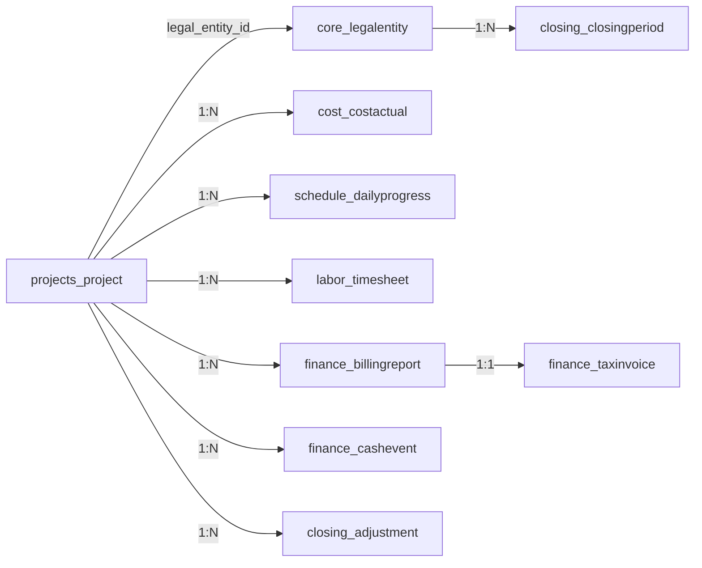

# 건설 ERP 물리 ERD

> 기준 DB: Django 5.2 ORM이 생성·관리하는 PostgreSQL 스키마. 표 이름은 실제 `Model._meta.db_table`을 점검하여 기록했다. PK는 별도 지정이 없는 한 `id bigint`, 사용자 FK는 `auth_user.id`를 참조한다.

## 1. 물리 설계 원칙

- 관계 무결성은 Django FK와 `on_delete` 정책으로 구현한다. 금전·계약·마감 근거는 주로 `PROTECT`, 프로젝트 내부 구성은 `CASCADE`, 승인자 등 이력 참조는 `SET_NULL`이다.
- 모든 표의 명칭은 `<app>_<model>` 기본 규칙을 따른다. `Project.contracting_licenses`의 M:N은 Django 자동 중간 테이블로 생성된다.
- 날짜·상태·프로젝트 기준 조회에 필요한 인덱스 및 UniqueConstraint가 모델 `Meta`에 선언돼 있다.

## 2. 테이블 카탈로그

| 도메인 | 물리 테이블 |
|---|---|
| 권한/법인 | `core_organizationgroup`, `core_legalentity`, `core_legalentitylicense`, `core_legalentitycreditrating`, `core_legalentitylicenseconstructionperformance`, `core_legalentitylicenseconstructionperformanceevidence`, `core_userprofile`, `core_userlegalentitymembership`, `core_projectassignment`, `core_approvalrequest` |
| 프로젝트/계약 | `projects_project`, `projects_projectcodesequence`, `projects_projectoperationaltestdatewindow`, `projects_budgetitem`, `projects_wbsitem`, `projects_wbschangerequest`, `projects_wbschangeline`, `projects_approvalpackage`, `projects_approvalpackageitem`, `projects_projectcontract`, `contracts_contractchange`, `contracts_contractsnapshot` |
| CBS/마스터 | `cost_costitem`, `cost_costitemalias`, `master_favoritecostitem`, `master_cbschangerequest`, `master_mastertemplate`, `master_masterwbstemplateitem`, `master_masterbudgettemplateitem` |
| FIELD/일정/보고 | `schedule_scheduleplan`, `schedule_scheduletask`, `schedule_dailyprogress`, `schedule_progresscorrectionrequest`, `schedule_planchangerequest`, `field_dailyreport`, `field_dailyreportline`, `field_retroactiveentryrequest`, `reports_fieldreport`, `reports_fieldreportfile`, `evidence_evidence`, `evidence_evidencefile`, `evidence_evidencepolicy` |
| 원가/재무 | `cost_costactual`, `cost_costactualline`, `cost_revenuerecognition`, `cost_revenuerecognitionclose`, `finance_cashaccount`, `finance_cashevent`, `finance_advancepayment`, `finance_progressbilling`, `finance_billingreport`, `finance_taxinvoice`, `finance_expenseexecution` |
| 재고 | `inventory_warehouse`, `inventory_location`, `inventory_uom`, `inventory_itemcategory`, `inventory_itemmaster`, `inventory_projectmaterialrequest`, `inventory_itemcodesequence`, `inventory_transfernumbersequence`, `inventory_issuenumbersequence`, `inventory_transfer`, `inventory_transferline`, `inventory_issuetowork`, `inventory_issuetoworkline`, `inventory_inventoryledger`, `inventory_stock` |
| 노무/급여 | `labor_laborrole`, `labor_laborratetable`, `labor_workermaster`, `labor_laborworkledger`, `labor_labormonthlypayroll`, `labor_electroniccardimportbatch`, `labor_electroniccardworkraw`, `labor_electroniccardworkday`, `labor_laborreconciliationresult`, `labor_laborconfirmedworkday`, `labor_laborcomplianceexport`, `labor_laborexcelexportbatch`, `labor_timesheetnumbersequence`, `labor_timesheet`, `labor_timesheetline`, `labor_payrollbatchnumbersequence`, `labor_payrollallocationbatch`, `labor_payrollallocationline`, `labor_officeemployeeprofile`, `labor_incometaxtableversion`, `labor_incometaxtablerow`, `labor_officeemployeenumbersequence`, `labor_officepayrollrun`, `labor_officepayrollcorrection`, `labor_officepayrolldeductionpolicy`, `labor_officepayslip` |
| 마감/감사/리스크 | `closing_closingperiod`, `closing_projectclose`, `closing_adjustment`, `audit_auditlog`, `risk_riskrule`, `risk_riskevent`, `risk_riskfinding` |

## 3. 핵심 테이블 관계·키

| 자식 테이블 | FK/1:1 열 | 부모 테이블 | 삭제 정책 / 비고 |
|---|---|---|---|
| `projects_project` | `legal_entity_id` | `core_legalentity` | PROTECT, 계약 법인 |
| `core_legalentitycreditrating` | `legal_entity_id`, `created_by_id` | 법인·사용자 | 법인 PROTECT, 입력자 SET_NULL; 평가기관·등급·기준일·유효기간 스냅샷 |
| `core_legalentitylicenseconstructionperformance` | `license_id`, `created_by_id` | 법인 면허·사용자 | 면허 PROTECT, 입력자 SET_NULL; 공종별 3년/5년 실적 기준일 스냅샷 |
| `core_legalentitylicenseconstructionperformanceevidence` | `performance_id`, `uploaded_by_id` | 실적 스냅샷·사용자 | 스냅샷 CASCADE, 업로드자 PROTECT; 원본명·콘텐츠유형·용량·SHA-256 보관, 파일 교체 금지 |
| `projects_budgetitem` | `project_id`, `cost_item_id` | 프로젝트, CBS | CASCADE / PROTECT |
| `projects_wbsitem` | `project_id`, `parent_id` | 프로젝트, 자기참조 WBS | CASCADE / SET_NULL |
| `schedule_dailyprogress` | `project_id`, `plan_id`, `task_id`, `reporter_id` | 프로젝트·일정·작업·사용자 | 승인 진행률 근거 |
| `cost_costactual` | `project_id`, `source_daily_report_id`, `approved_by_id` | 프로젝트·일일보고·사용자 | 일일보고는 1:1, 프로젝트 PROTECT |
| `cost_costactualline` | `cost_actual_id`, `cost_item_id` | 원가헤더·CBS | CASCADE / PROTECT |
| `inventory_warehouse` | `legal_entity_id`, `project_id` | 법인·프로젝트 | 법인 PROTECT, 현장창고 프로젝트 nullable |
| `inventory_stock` | `warehouse_id`, `location_id`, `item_id` | 창고·위치·품목 | 현재고 스냅샷 |
| `inventory_inventoryledger` | `warehouse_id`, `location_id`, `item_id`, `uom_id` | 창고·위치·품목·단위 | 재고 원장 |
| `inventory_issuetowork` | `project_id`, `warehouse_id`, `cost_actual_id` | 프로젝트·창고·원가 | `cost_actual_id` nullable 1:1; 승인 처리 시 생성·연결 |
| `labor_timesheetline` | `timesheet_id`, `worker_id`, `labor_role_id`, `applied_rate_id` | 출역부·근로자·직종·단가 | `worker_id`, `applied_rate_id` nullable; 금액/단가 자체도 스냅샷 보관 |
| `labor_officepayrollrun` | `legal_entity_id`, `approved_by_id` | 고용 법인·사용자 | 법인별 급여대장 |
| `labor_officepayslip` | `run_id`, `employee_id`, `auto_income_tax_table_version_id` | 급여대장·직원·세액표 | 명세서 금액 스냅샷 |
| `finance_billingreport` | `project_id`, 생성/검토/승인자 FK | 프로젝트·사용자 | 보고차수별 기성/준공 원장 |
| `finance_taxinvoice` | `billing_report_id` | 기성·준공 보고서 | 1:1, 발주처 확정 후 발행 |
| `finance_cashevent` | `project_id`, `contract_snapshot_id`, `account_id` | 프로젝트·계약스냅샷·법인계좌 | 계좌 법인=프로젝트 법인 검증 |
| `closing_closingperiod` | `legal_entity_id`, `closed_by_id` | 법인·사용자 | 법인+연+월 Unique |
| `closing_adjustment` | `project_id`, `cbs_id`, generic target | 프로젝트·CBS·원본 | 마감월 사후 정정 |

## 4. 주요 물리 제약·인덱스

| 대상 | 제약/인덱스 |
|---|---|
| `core_legalentity` | `code` unique |
| `core_legalentitylicense` | `(legal_entity_id, license_type, registration_number)` unique |
| `core_legalentitycreditrating` | `(legal_entity_id, rating_agency, assessed_on)` unique; `(legal_entity_id, valid_until)` 인덱스 |
| `core_legalentitylicenseconstructionperformance` | `(license_id, work_category, as_of_date)` unique; `(license_id, as_of_date)`, `(external_category_code, as_of_date)` 인덱스 |
| `core_legalentitylicenseconstructionperformanceevidence` | `(performance_id, created_at)` 인덱스; 허용 확장자 PDF/XLSX/XLS/PNG/JPG/JPEG, 폼 업로드 최대 20MB |
| `core_userlegalentitymembership` | `(user_id, legal_entity_id)` unique; 사용자/법인 활성 인덱스 |
| `projects_project` | `code` unique |
| `projects_projectcodesequence` | `(legal_entity_id, project_type, year)` unique |
| `projects_budgetitem` | `(project_id, cost_item_id)` 인덱스; 수입 원행 중복은 허용 |
| `projects_approvalpackageitem` | `(package_id, item_type, object_id)` unique |
| `finance_advancepayment` | 선급률 0~100 CheckConstraint |
| `finance_progressbilling` | `(project_id, billing_date)` unique |
| `finance_billingreport` | `(project_id, report_type, billing_round)` unique |
| `finance_taxinvoice` | `invoice_number` unique, 보고서 1:1 |
| `closing_closingperiod` | `(legal_entity_id, year, month)` unique |
| `closing_projectclose` | 프로젝트 선택적 1:1 |
| `cost_*`, `finance_cashevent`, `closing_adjustment` | 프로젝트·일자·상태 조합 인덱스로 대시보드/마감 조회 지원 |

## 5. ERD 구현상 유의점



- `JSONField`: `Project.work_types`, `BillingReport.engineer_notes`, `BillingReport.attachment_checklist` 등은 유연한 화면 입력을 보관한다. 정형 분석 항목은 별도 열/테이블로 승격해야 한다.
- Generic FK: `closing_adjustment`는 유형별 원본을 유연하게 참조한다. DB가 원본 행 존재를 FK로 보장하지 않으므로 승인 서비스와 정기 무결성 점검이 필요하다.
- 금액: 프로젝트 계약액은 `DecimalField`, 출역·재고 단가와 일부 원장은 `BigIntegerField`를 사용한다. 원가 세부(`cost_costactualline`)는 `DecimalField`이며, 입력총액·공급가액·VAT·회계원가를 별도 열로 보관한다.

## 6. 검증 정정 이력

- `IssueToWork.cost_actual`와 `TimesheetLine.applied_rate`를 필수 관계로 서술한 오류를 nullable 관계로 정정했다.
- `ProjectContract`와 `ProjectClose`는 프로젝트 생성과 동시에 항상 존재하는 표가 아니므로 선택적 1:1로 해석해야 한다.
- 원가 세부의 금액 타입을 `BigIntegerField`로 뭉뚱그린 오류를 `DecimalField`와 VAT 분리 열 기준으로 정정했다.

## 7. 근거 및 재생성 방법

실제 테이블명은 다음 ORM 메타데이터로 점검했다.

```text
python manage.py shell -c "from django.apps import apps; ... m._meta.db_table ..."
```

변경 시 `makemigrations --check`, `migrate --plan`, 위 카탈로그 재점검을 함께 수행한다.
