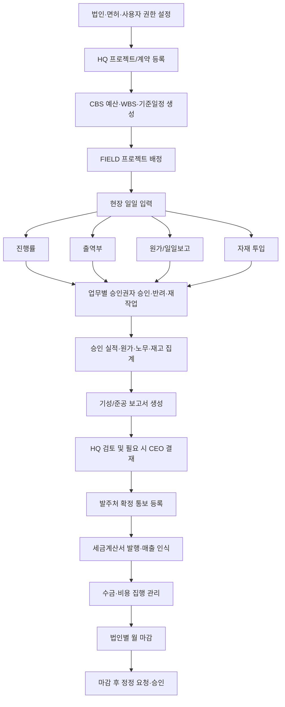
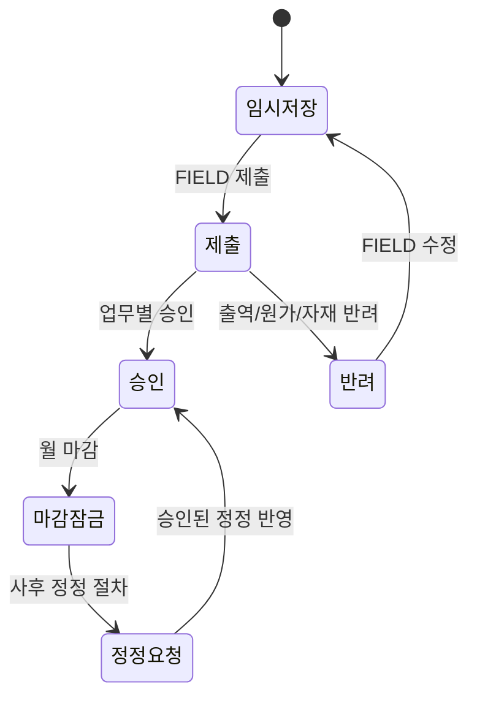
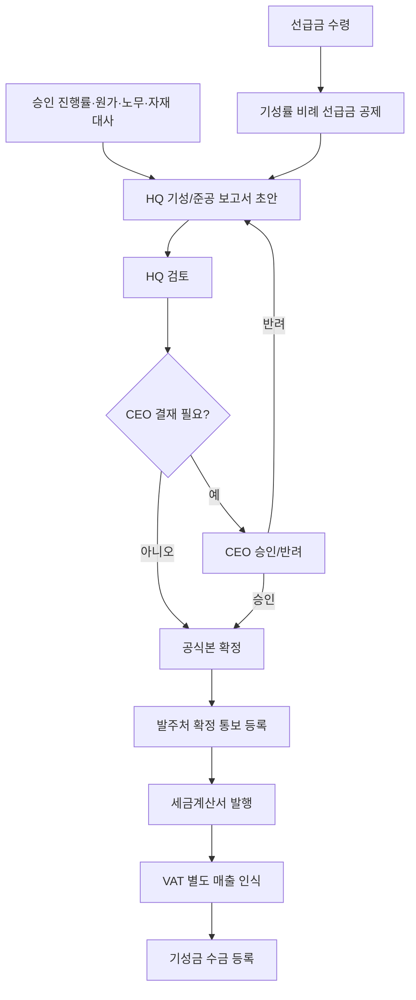
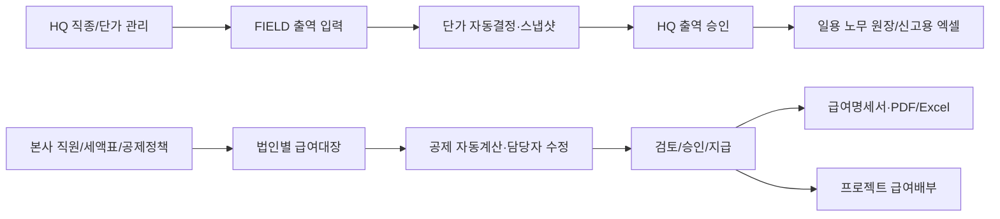

# 건설 ERP 프로세스맵

> 기준: 현재 구현의 FIELD → HQ → CEO 및 법인별 월마감 흐름. 실제 권한은 역할뿐 아니라 법인 멤버십과 프로젝트 배정을 함께 검사한다.

## 1. 전사 운영 흐름

## 2. 법인·프로젝트 착수

| 단계 | 수행자 | 기능/산출물 | 통제 |
|---|---|---|---|
| 법인 등록 | 그룹 HQ/시스템 관리자 | 법인, 면허, 법인별 은행계좌·창고 | 계약·재고·급여·마감의 법인 소유 분리 |
| 권한 설정 | 그룹 HQ | UserProfile, 법인 멤버십, 프로젝트 배정 | URL 직접 접근도 역할+법인+프로젝트 범위로 차단 |
| 공사 등록 | HQ | 계약 법인, 복수 적용 면허, 공종, 계약금액/기간 | 프로젝트당 계약 법인은 1개 |
| 기준정보 생성 | HQ | CBS 예산, WBS, 일정계획, 현장 창고 | 예산과 WBS는 프로젝트 범위로 고정 |
| 현장 배정 | HQ | FIELD 사용자 ProjectAssignment | 타 법인 직원도 운영지원/배정은 가능하나 소유 법인은 변하지 않음 |

## 3. FIELD 일일 운영·승인

| 업무 | FIELD 입력 | 자동 처리 | HQ/CEO 처리 |
|---|---|---|---|
| 진행률 | 작업·일자·진행률·메모 | WBS 가중치 집계, 대시보드 잠정/승인 진행률 | 승인/반려 후 FIELD 수정·재제출; 승인건 정정은 HQ 검토→CEO 승인 요청 |
| 출역부 | 근로자·직종·공수·일자 | HQ 단가표 우선순위로 적용 단가 스냅샷 | HQ 승인/반려; 승인 출역은 노무·급여 자료 |
| 원가 | CBS·일자·금액·증빙 | VAT 분리, 승인 원가 집계, CEO 승인 시 비용집행 대상 | HQ/CEO 승인 경로 |
| 자재 투입 | 현장창고 품목·CBS·수량 | 단가 자동 적용, 재고 차감·원가실적 생성 | HQ 승인/반려; 예산 외 품목은 품목 요청 |
| 일일/현장 보고 | 원가용 일일 원본 또는 별도 현장보고·사진·첨부 | Evidence 파일 보관 | `DailyReport`는 원가 원본, `FieldReport`가 독립 보고서 흐름 |

## 4. 창고·자재 흐름

## 5. 기성·선급금·매출·현금

- 선급금은 수령 시 **현금흐름**이며 즉시 매출이 아니다.
- 기성청구 시 선급금 공제액과 순청구액을 스냅샷으로 남긴다.
- 관공서 공사 정책상 발주처 확정 통보 후 세금계산서를 발행하고, 세금계산서 기준으로 실제 매출을 인식한다.

## 6. 월 마감·준공 대사·사후 정정

| 단계 | HQ 처리 | 시스템 통제 |
|---|---|---|
| 대사 | 프로젝트·기준일 선택 후 승인 진행률, 출역/노무비, 원가/자재, 현장재고, 미승인/반려 건 확인 | 불일치·미승인 건이 있으면 준공청구/마감 진행 차단 |
| 마감 요청/확정 | 법인·연월별로 HQ 단독, HQ 2단계 또는 CEO 예외 정책 선택 | `ClosingPeriod` 법인+연월 Unique |
| 잠금 | 마감월 일반 입력·수정 차단 | 승인·집계 스냅샷 보호 |
| 정정 | Adjustment 또는 도메인별 정정 요청 등록·승인 | 원본 삭제/직접 수정 대신 차액·사유·승인 이력 보관 |
| 준공 | 최종 기성/준공 보고서, 세금계산서, 프로젝트 종료 | `ProjectClose`에서 프로젝트 단위 종료 상태 관리 |

## 7. 노무·본사급여

## 8. 공통 횡단 통제

- RBAC: FIELD/HQ/CEO 역할, 법인 멤버십, 프로젝트 배정을 결합해 검증하도록 설계되어 있다. 신규/변경 View와 API는 이 세 범위의 회귀 테스트가 필요하다.
- AuditLog: 승인, 마감, 수금, 정정, 다운로드 등 주요 행위를 남긴다.
- Evidence: 파일과 정책을 도메인 증빙에 연결한다.
- Risk: 규칙·이벤트·조치상태를 통해 대시보드 리스크 큐에 노출한다.
