# 공사일보·월 정산 확장 논리 ERD v1.1

> 기존 `DailyReport`는 원가 입력의 보조 원본으로 유지한다. 아래의 `SiteDailyLog`는 작업·물량·반입·장비·대사 목적의 **별도 업무 개념**이다.

> 정밀 검증 반영: V-01(WBS-일정작업 매핑), V-02(일지 정정 요청), V-03(거래처/지급계좌), V-04(원가 원천 경계), V-06(마감 파생 잠금), V-07(마감 정산 보존).

## 1. 논리 관계

```mermaid
erDiagram
  LEGAL_ENTITY ||--o{ PROJECT : contracts
  PROJECT ||--o{ SITE_DAILY_LOG : has
  USER ||--o{ SITE_DAILY_LOG : reports
  SITE_DAILY_LOG ||--o{ SITE_DAILY_LOG_WORK_LINE : records
  PROJECT ||--o{ PROJECT_WORK_PROGRESS_MAPPING : configures
  WBS_ITEM ||--o{ PROJECT_WORK_PROGRESS_MAPPING : maps
  SCHEDULE_TASK ||--o{ PROJECT_WORK_PROGRESS_MAPPING : maps
  PROJECT_WORK_PROGRESS_MAPPING ||--o{ SITE_DAILY_LOG_WORK_LINE : measures
  SITE_DAILY_LOG ||--o{ SITE_DAILY_LOG_EQUIPMENT_LINE : deploys
  SITE_DAILY_LOG ||--o{ SITE_DAILY_LOG_RECEIPT_REF : references
  INVENTORY_LEDGER ||--o{ SITE_DAILY_LOG_RECEIPT_REF : is_receipt_source
  SITE_DAILY_LOG ||--o{ SITE_DAILY_LOG_EVIDENCE : supports
  EVIDENCE ||--o{ SITE_DAILY_LOG_EVIDENCE : attaches
  SITE_DAILY_LOG ||--o{ SITE_DAILY_LOG_CORRECTION_REQUEST : corrects

  PROJECT ||--o{ MONTHLY_PROJECT_SETTLEMENT : summarizes
  LEGAL_ENTITY ||--o{ MONTHLY_PROJECT_SETTLEMENT : owns
  MONTHLY_PROJECT_SETTLEMENT ||--o{ SETTLEMENT_COST_SUMMARY : aggregates
  COST_ITEM ||--o{ SETTLEMENT_COST_SUMMARY : classifies
  MONTHLY_PROJECT_SETTLEMENT ||--o{ SETTLEMENT_RECONCILIATION : checks
  MONTHLY_PROJECT_SETTLEMENT ||--o{ SETTLEMENT_SNAPSHOT : freezes

  PROJECT ||--o{ PAYABLE_ITEM : incurs
  LEGAL_ENTITY ||--o{ PAYABLE_ITEM : owes
  PAYABLE_ITEM ||--o{ PAYABLE_PAYMENT_ALLOCATION : settled_by
  CASH_EVENT ||--o{ PAYABLE_PAYMENT_ALLOCATION : pays
  PAYABLE_ITEM }o--o| COST_ACTUAL : source_cost
  PAYABLE_ITEM }o--o| EXPENSE_EXECUTION : execution
  BUSINESS_PARTNER ||--o{ PAYABLE_ITEM : counterparty
  BUSINESS_PARTNER ||--o{ BUSINESS_PARTNER_PAYMENT_ACCOUNT : owns
  BUSINESS_PARTNER_PAYMENT_ACCOUNT ||--o{ PAYABLE_ITEM : paid_to
  PROGRESS_BILLING ||--o{ BILLING_SETTLEMENT_ALLOCATION : settles
  PAYABLE_ITEM ||--o{ BILLING_SETTLEMENT_ALLOCATION : owner_direct_offsets
  CASH_EVENT ||--o{ BILLING_SETTLEMENT_ALLOCATION : cash_receipt
  BUSINESS_PARTNER ||--o{ SUBCONTRACT_AGREEMENT : contracts
  PROJECT ||--o{ SUBCONTRACT_AGREEMENT : has
  SUBCONTRACT_AGREEMENT ||--o{ SUBCONTRACT_PROGRESS_CERTIFICATE : certifies
  SUBCONTRACT_AGREEMENT ||--o{ SUBCONTRACT_CLAIM : receives
  SUBCONTRACT_PROGRESS_CERTIFICATE ||--o| PAYABLE_ITEM : accrues

  ACCOUNT_SUBJECT ||--o{ ACCOUNT_COST_MAPPING : maps
  COST_ITEM ||--o{ ACCOUNT_COST_MAPPING : maps
  PROJECT ||--o{ PROJECT_COST_ALLOCATION_RULE : allocates
  ACCOUNT_COST_MAPPING ||--o{ PROJECT_COST_ALLOCATION_RULE : defaults
```

## 2. 엔터티 정의

| 엔터티 | 의미 | 소유/범위 | 기존 객체와 관계 |
|---|---|---|---|
| SiteDailyLog | 현장 일일 작업·계획·특이사항과 일일 대사의 헤더 | 프로젝트 | 기존 DailyReport와 별도 |
| SiteDailyLogWorkLine | WBS-일정작업 매핑별 물량 실적 | 공사일보 | QUANTITY 방식에서 공식 진행률 원천 |
| ProjectWorkProgressMapping | WBS와 ScheduleTask의 프로젝트별 공식 연결·계산방식 | 프로젝트 | 물량 기반/수기 기반 진행률 중복 방지 |
| SiteDailyLogEquipmentLine | 장비의 일별 가동 기록 | 공사일보 | CostActual 장비비와 선택 연결 |
| SiteDailyLogReceiptRef | 현장 반입 원장 참조 | 공사일보 | InventoryLedger RECEIPT를 참조 |
| SiteDailyLogEvidence | 일지 증빙 연결 | 공사일보 | Evidence의 연결 테이블 |
| SiteDailyLogCorrectionRequest | 마감 후 공사일보 정정 요청 | 프로젝트/원 일지 | 원본·변경안·영향·승인 이력 보존 |
| MonthlyProjectSettlement | 법인·프로젝트·기준월 정산 헤더 | 법인+프로젝트+월 | ClosingPeriod와 별도, 마감 시 스냅샷 |
| SettlementCostSummary | CBS/비용분류별 정산 집계 | 정산서 | CostActual·노무·재고 원가 집계값 |
| SettlementReconciliation | 대사 항목별 결과와 차이 | 정산서 | 대사 서비스 결과 보관 |
| SettlementSnapshot | 확정 시점의 JSON/파일 해시 | 정산서 | 재생성 가능성과 감사성 보장 |
| PayableItem | 비용 발생 후 미지급 채무 | 법인+프로젝트 | CostActual/ExpenseExecution/CashEvent 연결 |
| PayablePaymentAllocation | 한 미지급금의 다회 회사지급 배분 | 미지급금 | 회사 CashEvent OUT 연결. 발주처 직불은 BillingSettlementAllocation 사용 |
| BillingSettlementAllocation | 기성 미수금의 현금수금·발주처직불 정산 | 기성청구 | 직불은 PayableItem과 연결하고 CashEvent를 만들지 않음 |
| BusinessPartner | 거래처 마스터 | 법인 사용범위 | 거래처명·사업자 정보의 중복 방지 |
| BusinessPartnerPaymentAccount | 거래처의 보호된 지급계좌 | 거래처 | 계좌번호 암호화/마스킹 및 사용기간 관리 |
| SubcontractAgreement | 하도급 계약·변경·공제조건 스냅샷 | 프로젝트·법인·협력사 | 원수급 계약과 별도 |
| SubcontractProgressCertificate | 하도급 시공분 검수·기성 확정 | 하도급 계약 | 미지급금 발생 원천 |
| SubcontractClaim | 협력사 청구·세금계산서 수취 기록 | 하도급 계약 | 검수기성·지급과 독립 |
| AccountSubject | 회계 계정과목 마스터 | 법인 공통 또는 그룹 | CostItem과 별도 계층 |
| AccountCostMapping | 계정과목↔CBS/원가분류 매핑 | 법인/유효기간 | 입력 분류 추천·검증 |
| ProjectCostAllocationRule | 공통비의 배부규칙 | 프로젝트/법인 | 배부비율과 승인근거 보관 |

## 3. 핵심 업무 규칙

1. `SiteDailyLog`는 `(project, report_date)` 당 하나만 존재한다. 여러 FIELD 작성자는 공동 편집이 아니라 작성자 지정·이력으로 처리한다.
2. `SiteDailyLogWorkLine`은 하나의 `ProjectWorkProgressMapping`을 하루에 한 번만 기록한다. `QUANTITY` 매핑과 `MANUAL` 진행률은 같은 ScheduleTask에 동시 활성화할 수 없다.
3. `SiteDailyLogReceiptRef`는 재고 원장을 수정하지 않으며, 승인된 현장 입고 원장을 참조한다.
4. `MonthlyProjectSettlement`는 `(legal_entity, project, year, month)` 당 하나다. 프로젝트 계약 법인과 정산 법인은 반드시 같다.
5. `PayableItem`은 발생액과 지급액을 분리하며, 하나의 비용에 복수 지급·일부 직불을 허용한다.
6. `AccountCostMapping`의 유효기간이 겹치면 동일 법인·계정과목·CBS 조합에 대해 하나만 활성화될 수 있다.
7. 월마감 후 `SettlementSnapshot`은 교체하지 않는다. 재정산은 새 버전과 정정 근거를 남긴다.
8. 마감 후 일지의 물량/장비/반입 참조 정정은 `SiteDailyLogCorrectionRequest`로만 가능하며, 재고·현금·원가 효과는 각 원천 정정 흐름에서 처리한다.
9. `PayableItem`은 발생일·증빙일·지급예정일·실제지급일을 구분한다. 실제지급일은 PayablePaymentAllocation/CashEvent의 일자다.
10. `OWNER_DIRECT` BillingSettlementAllocation은 하나의 기성청구와 하나 이상의 미지급금을 연결하는 비현금 상계이며, 회사 CashEvent를 생성할 수 없다.
11. SubcontractProgressCertificate, SubcontractClaim, PayablePaymentAllocation은 각각 검수기성·청구·지급을 뜻하며 서로 다른 상태를 가진다.

## 4. 기존 객체와의 경계

| 기존 객체 | 유지 역할 | 신규 설계와의 접점 |
|---|---|---|
| DailyProgress | 승인 진행률의 원천 | 물량기반 WBS 계산 결과를 참조하되 기존 수기 진행률을 강제 대체하지 않음 |
| DailyReport | 원가 입력 보조 원본 | 공사일보로 이름 변경하거나 승인 큐를 중복 생성하지 않음 |
| Timesheet | 근로자별 출역·노무비 원천 | 공사일보에 직종별 합계만 표시 |
| IssueToWork/InventoryLedger | 자재 투입·재고 원천 | 공사일보는 반입·투입 대사만 수행 |
| CostActual | 승인 원가 원천 | 정산서의 원가·미지급금 근거 |
| ExpenseExecution/CashEvent | 집행·현금 원천 | 미지급금 지급배분과 정산 현금흐름 근거 |
| BillingReport/ProgressBilling | 기성·청구·수금 원천 | 정산서의 기성·미수·선급금 공제 근거 |
