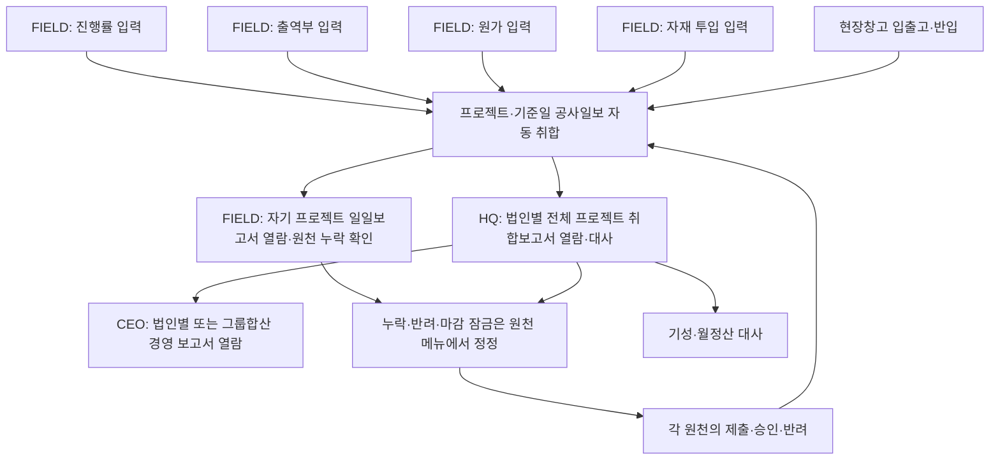
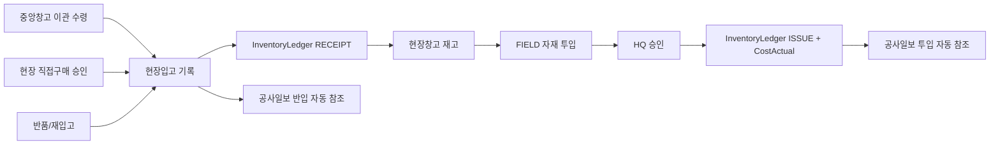
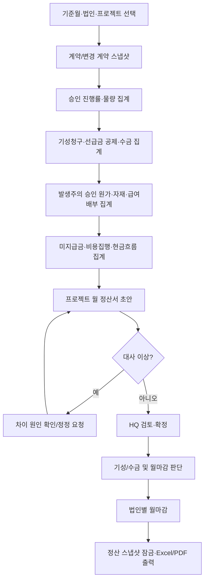
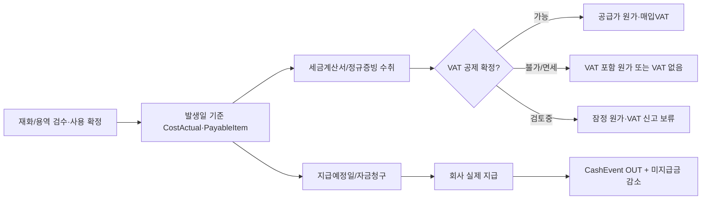
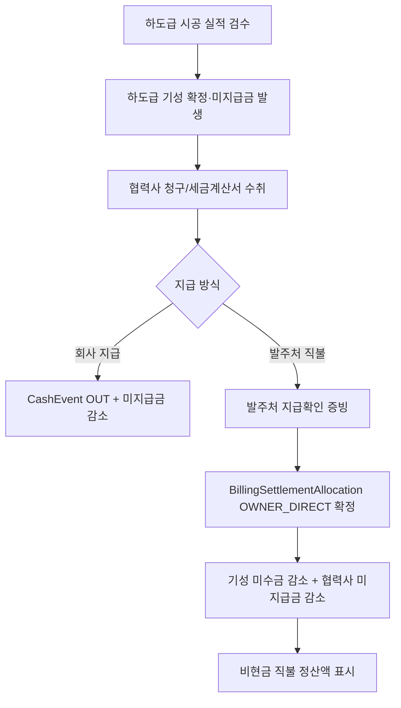
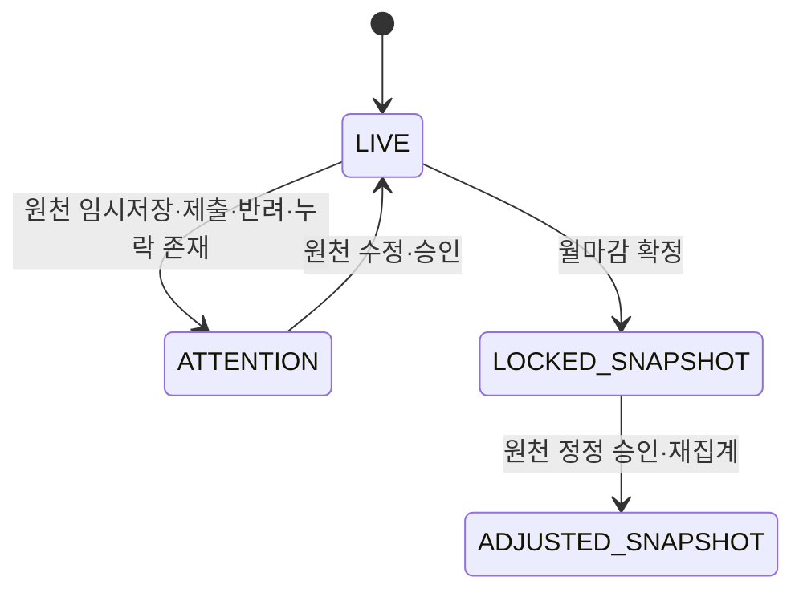

# 공사일보·월 정산 확장 프로세스맵 v1.4

> 설계 기준: 2026-08-26. v1.1은 승인된 비용 발생·VAT·발주처 직불·하도급 정책을 반영한다. 대상은 기존 FIELD 진행률·출역·원가·자재·창고·기성·수금·월마감 기능을 **대체하지 않고 연결**하는 공사일보 및 프로젝트 월 정산 계층이다.

> 정밀 검증 반영: V-01(WBS-일정작업 매핑), V-02(마감 후 일지 정정), V-04(원가 중복 방지), V-06(파생 잠금). 상세 근거는 `daily_site_log_monthly_settlement_design_validation_report.md`를 따른다.

> **v1.3 전환 결정:** 공사일보는 FIELD가 별도로 작성·제출·승인하는 업무 원천이 아니다. 진행률·출역부·원가·자재투입 등 기존 원천을 프로젝트·기준일로 자동 취합하여 보여주는 읽기 전용 보고서이며, 원천별 상태가 보고서의 신뢰도를 결정한다. 현장 메모는 기존 원천에 없는 경우에만 별도 보완 정보로 허용한다.

> **v1.4 메뉴 전환:** FIELD의 `보고서` 메뉴를 폐지하고, 메뉴 순서를 `진행률 → 출역부 → 원가 → 자재투입 → 공사일보 → 창고조회 → 승인완료`로 고정한다. 기존 현장보고서는 신규 작성 흐름에서 제외하고 이력·기존 승인 처리용으로만 보존한다.

## 1. 운영 원칙

- 공사일보는 현장 운영의 일일 **자동 취합·대사 보고서**다. 이미 제출된 진행률·출역부·자재 투입·원가를 다시 입력·생성·승인하지 않는다.
- FIELD는 자신의 배정 프로젝트별 공사일보만 열람한다. HQ·CEO는 법인 범위 안의 여러 프로젝트를 같은 기준일로 취합한 전사 공사일보를 열람한다. 그룹합산은 읽기 전용이며 법인별 수치를 분리 표시한다.
- 일일 물량은 프로젝트별 `ProjectWorkProgressMapping`(WBS-일정작업 매핑)에 연결한다. 현재 ERP의 공식 진행률 원천은 `ScheduleTask`이므로, WBS만으로 진행률을 직접 계산하지 않는다.
- 자재 **반입**은 자재 **투입(출고)** 과 다르다. 반입은 현장창고 입고 또는 중앙창고 이관 수령이고, 투입은 현장창고에서 공사에 사용한 출고다.
- 월 정산은 법인·프로젝트·기준월별 집계 문서다. 계약·기성·선급금·수금·원가·미지급금·지급계획의 원천을 변경하지 않는다.
- 월마감 뒤 변경은 원본 직접 수정이 아니라 기존 Adjustment/정정 절차를 따른다.

## 2. 현장 일일 운영 흐름

### 2.1 업무별 원천과 공사일보의 역할

| 영역 | 원천 객체 | 공사일보 처리 | 금지 사항 |
|---|---|---|---|
| 작업·특이사항 | 진행률 메모·기존 보고서 메모·선택 보완메모 | 자동 표시, 보완메모는 비재무 참고정보 | 보완메모로 원가·진행률을 생성하거나 승인하지 않음 |
| 물량·진행률 | DailyProgress + ScheduleTask + WBS 매핑 | 계획·전일·금일·누계 및 승인상태 자동 대사 | 자유 텍스트나 별도 일지 물량을 기성 근거로 사용하지 않음 |
| 인력 투입 | Timesheet/TimesheetLine | 직종별 승인 공수를 읽기 전용 집계 | 일지에서 인원 공수를 재입력해 출역과 이중 계상하지 않음 |
| 자재 반입 | 현장입고/이관수령 | 입고 수량·증빙·입고원천 표시 | 자재 투입으로 재고를 차감하지 않음 |
| 자재 투입 | IssueToWork/InventoryLedger | 승인 출고량을 읽기 전용 집계 | 일지 제출만으로 원가를 재생성하지 않음 |
| 장비 투입 | 승인 CostActual/장비 관련 원천 | 장비 원가·사용내역을 자동 참조 | 보고서에서 장비비 원가를 자동 확정하지 않음 |

## 3. 현장 자재 반입 흐름

## 4. 월 정산 및 마감 흐름

### 4.1 월 정산 대사 규칙

| 대사 대상 | 비교 기준 | 불일치 시 처리 |
|---|---|---|
| 물량·진행률 | 승인 물량 누계와 승인 진행률/WBS 가중치 | 경고, 기성·준공 보고서 확정 차단 |
| 재고 | 기초 + 반입 - 투입 - 반송 = 기말 | 경고, 월마감 전 재고조정 또는 사유 등록 |
| 원가 | 승인 `CostActual` 및 별도 원가전표가 없는 승인 급여배부 | 자재투입에서 생성된 CostActual·출역 집계액을 중복 합산하지 않도록 원천별 중복 검증 후 정산 확정 |
| 미지급금 | 비용 발생액 - 확정 지급액 - 발주처 직불액 | 차이가 있으면 자금청구 확정 차단 |
| 기성·수금 | 청구액 - 선급금 공제 - 수금액 = 미수금 | 음수·기간 불일치 시 HQ 검토 요구 |
| 법인 | 프로젝트 계약 법인과 현금·창고·마감 법인 | 불일치 시 집계 제외 및 오류 표시 |

### 4.2 발생·VAT·지급 분리 흐름

- 비용은 지급일이 아니라 검수·사용 확정일에 발생시키며, 실제 지급은 현금흐름과 미지급금 감소로만 처리한다.
- 공제 가능 VAT가 확정되기 전에는 자동으로 총액을 1.1로 나누지 않는다.

### 4.3 발주처 직불 및 하도급 흐름

- 발주처 직불은 회사 CashAccount 입출금을 만들지 않는다.
- 하도급 시공 실적, 협력사 청구, 실제 지급은 별도 상태이며 어느 하나가 다른 상태를 자동 확정하지 않는다.

## 5. 보고서 상태와 원천 정정 흐름

- 공사일보에는 독립 `DRAFT/SUBMITTED/APPROVED/REJECTED` 상태를 저장하지 않는다. 보고서 상태는 포함된 원천의 상태를 계산한 `LIVE/ATTENTION/LOCKED_SNAPSHOT/ADJUSTED_SNAPSHOT`으로 표시한다.
- 반려·정정은 해당 진행률·출역·원가·자재투입 원천에서 처리한다. 보고서 화면은 원천 메뉴로 이동시키는 안내만 제공한다.
- `LOCKED_SNAPSHOT`은 해당 법인 `ClosingPeriod`에서 파생한다. 마감 후에는 원천의 기존 정정 절차가 승인된 경우에만 다음 보고서 버전이 생성된다.

## 6. 역할별 책임

| 역할 | 책임 |
|---|---|
| FIELD | 자신이 배정된 프로젝트의 자동 공사일보 열람, 누락·반려 원천 확인 및 해당 메뉴에서 수정 |
| 법인 HQ | 법인 전체 프로젝트 취합 공사일보 열람·대사, 원천 승인·정정 관리, 자금청구·미지급금 검토, 월 정산 확정 |
| 그룹 HQ | 양 법인의 정산 현황 조회 및 운영 기준 관리. 타 법인 원장 수정은 법인 권한을 별도로 가져야 함 |
| CEO | 법인별·그룹합산 취합 공사일보 열람 및 기존 정책상 필요한 기성·준공·마감·정정 결재. 일일 공사일보의 별도 승인자는 아님 |
| 시스템 관리자 | 계정과목 매핑·출력 양식·권한 정책 관리. 업무 금액을 직접 확정하지 않음 |

## v1.2 개정 범위 — AI Layer 연계 준비(설계 전용)

이 문서의 v1.2 개정은 `Construction_ERP_AI_Layer_Implementation_Design_Pack_v1.3`의
법인 범위, SoR 단일권위, 금액 의미, Evidence·Claim 재현성, 승인·마감 보존 원칙을
공사일보·월 정산 확장 설계에 연결한 것이다. **이번 버전은 AI 호출, AI 테이블,
마이그레이션, 외부 Provider 연결, 기존 업무 화면의 코드 구현을 포함하지 않는다.**

- 기존 ERP 원천 시스템(SoR)이 계약·진행률·원가·재고·노무·기성·승인·마감의 유일한
  확정 권위를 가진다. AI/Ontology는 향후 읽기 전용 Context, Evidence, 설명·검토·초안에만 사용한다.
- 모든 향후 Context는 `legal_entity_id`, 범위(`PROJECT`/`LEGAL_ENTITY`/`GROUP`),
  사용자·역할·법인 멤버십·프로젝트 배정의 권한 스냅샷을 먼저 확정한다. 프로젝트 범위는
  반드시 해당 프로젝트의 계약 법인과 일치하고, GROUP 범위는 명시적 그룹 권한이 있어야 한다.
- 계약·기성·원가·현금·세금 Claim에는 `amount_basis`(VAT 포함/별도/해당없음), 통화,
  기준일, 계산 서비스, 원천 스냅샷 해시를 함께 보존한다. 기준이 없는 핵심 금액 Claim은 생성·적용하지 않는다.
- 재무·계약·세금·승인·마감에 관한 핵심 Claim은 Claim ID와 Evidence link를 반드시 가져야
  하며, Evidence가 하나라도 없으면 향후 AI 결과의 적용·제출은 `BLOCK`한다. 일반 서술문은
  별도 관찰 지표로 관리하며 확정 사실로 승격하지 않는다.
- AI 초안의 기술 상태와 기존 문서의 HQ/CEO 승인·반려·잠금 상태를 분리한다. 승인 단일권위는
  기존 업무 workflow이며, AI/ontology의 장애·비활성화가 기존 업무를 중단시키지 않는다.

## 7. AI Layer 연계 운영 흐름(향후 적용, 현재 비활성)

1. FIELD, 법인 HQ, 그룹 HQ, CEO가 기존 업무를 수행할 때 먼저 법인·프로젝트·역할 범위를
   확정한다. 아산/미산/그룹 합산 조회는 조회 범위일 뿐, 타 법인의 원가·재고·현금·마감에 대한
   쓰기 권한을 부여하지 않는다.
2. 공사일보 및 월 정산에서 향후 AI가 참조할 수 있는 것은 승인된 진행률, 승인된 출역·자재·원가,
   확정 또는 검토 상태가 명확한 기성·정산·증빙뿐이다. `DailyReport`가 원가 입력 성격을 포함한다는
   사실을 현장 작업일보 Evidence와 혼동하지 않는다.
3. 마감월과 프로젝트 마감 상태에서는 기존 정정 workflow만 사용한다. AI/Ontology 경로가 이를
   우회하여 일지·원가·재고·기성·정산을 변경할 수 없다.
4. 향후 설명·초안 화면은 계산값을 다시 산출하거나 수정하지 않으며, 근거가 부족한 원인·판단은
   “근거 부족”으로 표시한다. 사용자는 AI 없이도 기존 작성·검토·승인·출력 업무를 완료할 수 있다.
